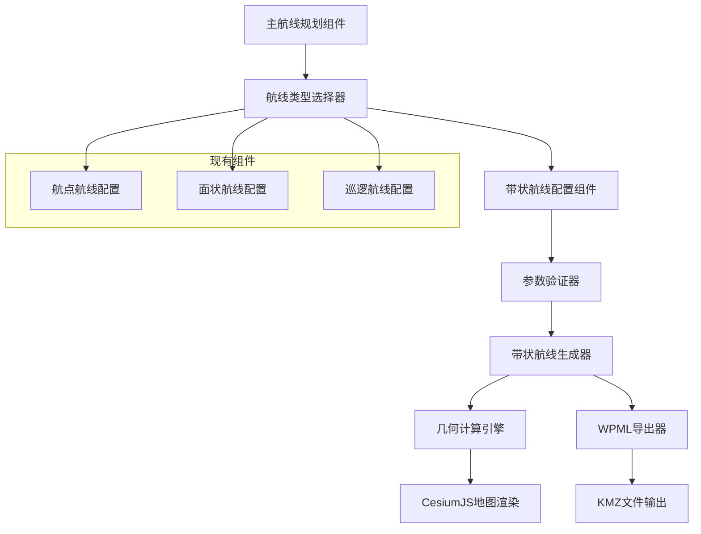
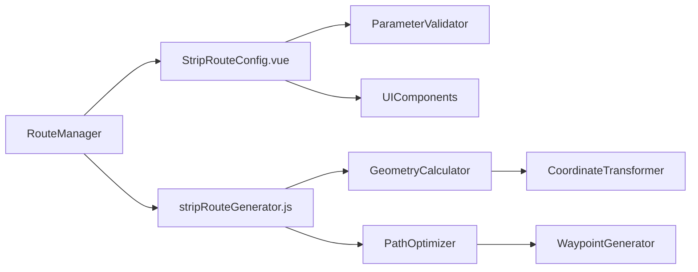

# 设计文档

## 概述

带状航线规划功能是对现有Vue 3 + CesiumJS航线规划系统的扩展，新增了沿中心线生成带状扫描航线的能力。该功能通过用户绘制的中心线和配置的扩展参数，自动生成S形或单线扫描路径，适用于河流巡检、道路监测、电力线巡检等线性目标的航拍任务。

设计遵循现有系统的架构模式，包括配置组件、生成算法和主控制器的分离，确保与现有航点航线、巡逻航线、面状航线功能的无缝集成。

## 架构

### 系统架构图



### 组件层次结构



## 组件和接口

### 1. StripRouteConfig.vue 配置组件

**职责**: 提供带状航线参数配置界面

**接口**:
```typescript
interface StripRouteConfigProps {
  centerLine: Coordinate[]
  onConfigChange: (config: StripRouteConfig) => void
  onValidationError: (errors: ValidationError[]) => void
}

interface StripRouteConfig {
  leftExtension: number      // 左侧扩展长度(米)
  rightExtension: number     // 右侧扩展长度(米)
  cuttingDistance: number    // 切割距离(米)
  routeMode: 'single' | 'zigzag'  // 航线模式
  altitude: number           // 飞行高度(米)
  speed: number             // 飞行速度(m/s)
  overlap: number           // 重叠率(%)
}
```

**主要方法**:
- `validateParameters()`: 验证输入参数
- `calculateMinAltitude()`: 根据扩展长度计算最小飞行高度
- `updatePreview()`: 实时更新航线预览

### 2. stripRouteGenerator.js 生成算法

**职责**: 基于中心线和配置参数生成带状扫描航线

**接口**:
```typescript
interface StripRouteGenerator {
  generateRoute(centerLine: Coordinate[], config: StripRouteConfig): RouteResult
  generateSingleRoute(centerLine: Coordinate[], config: StripRouteConfig): Waypoint[]
  generateZigzagRoute(centerLine: Coordinate[], config: StripRouteConfig): Waypoint[]
}

interface RouteResult {
  waypoints: Waypoint[]
  metadata: RouteMetadata
  statistics: RouteStatistics
}

interface Waypoint {
  longitude: number
  latitude: number
  altitude: number
  heading: number
  actions: WaypointAction[]
}
```

**核心算法**:
- `calculateParallelLines()`: 计算平行于中心线的扫描线
- `generateSPattern()`: 生成S形连接路径
- `optimizeWaypoints()`: 优化航点顺序和间距
- `validateCoverage()`: 验证覆盖完整性

### 3. GeometryCalculator 几何计算引擎

**职责**: 处理复杂的几何计算和坐标变换

**接口**:
```typescript
interface GeometryCalculator {
  calculatePerpendicularLine(point: Coordinate, bearing: number, distance: number): Coordinate[]
  calculateLineIntersection(line1: Coordinate[], line2: Coordinate[]): Coordinate | null
  calculateBearing(from: Coordinate, to: Coordinate): number
  calculateDistance(from: Coordinate, to: Coordinate): number
  smoothPath(waypoints: Waypoint[], smoothingFactor: number): Waypoint[]
}
```

### 4. ParameterValidator 参数验证器

**职责**: 验证用户输入参数的有效性

**接口**:
```typescript
interface ParameterValidator {
  validateExtensionLength(length: number): ValidationResult
  validateCuttingDistance(distance: number): ValidationResult
  validateCenterLine(centerLine: Coordinate[]): ValidationResult
  validateAltitude(altitude: number, extensions: number): ValidationResult
}

interface ValidationResult {
  isValid: boolean
  errors: ValidationError[]
  warnings: ValidationWarning[]
}
```

## 数据模型

### 中心线数据结构

```typescript
interface CenterLine {
  id: string
  name: string
  coordinates: Coordinate[]
  totalLength: number
  segments: LineSegment[]
}

interface LineSegment {
  start: Coordinate
  end: Coordinate
  bearing: number
  length: number
}
```

### 航线配置数据结构

```typescript
interface StripRouteConfiguration {
  id: string
  name: string
  centerLine: CenterLine
  parameters: StripRouteConfig
  createdAt: Date
  updatedAt: Date
}
```

### 生成结果数据结构

```typescript
interface GeneratedStripRoute {
  id: string
  configuration: StripRouteConfiguration
  waypoints: Waypoint[]
  coverageArea: Polygon
  statistics: {
    totalDistance: number
    estimatedFlightTime: number
    waypointCount: number
    coverageArea: number
  }
  wpmlData: WPMLData
}
```

## 错误处理

### 错误类型定义

```typescript
enum StripRouteErrorType {
  INVALID_CENTER_LINE = 'INVALID_CENTER_LINE',
  INVALID_EXTENSION_LENGTH = 'INVALID_EXTENSION_LENGTH',
  INVALID_CUTTING_DISTANCE = 'INVALID_CUTTING_DISTANCE',
  ALTITUDE_TOO_LOW = 'ALTITUDE_TOO_LOW',
  GEOMETRY_CALCULATION_ERROR = 'GEOMETRY_CALCULATION_ERROR',
  WPML_GENERATION_ERROR = 'WPML_GENERATION_ERROR'
}

interface StripRouteError {
  type: StripRouteErrorType
  message: string
  details?: any
  suggestions?: string[]
}
```

### 错误处理策略

1. **输入验证错误**: 实时显示错误提示，阻止无效操作
2. **几何计算错误**: 提供降级方案，简化计算复杂度
3. **生成失败错误**: 记录详细日志，提供重试机制
4. **导出错误**: 验证数据完整性，提供修复建议

## 测试策略

### 单元测试

**测试范围**:
- 参数验证逻辑
- 几何计算函数
- 航线生成算法
- WPML数据格式化

**测试工具**: Jest + Vue Test Utils

**关键测试用例**:
- 边界值测试（最小/最大扩展长度）
- 异常输入处理
- 复杂中心线几何计算
- S形路径生成正确性

### 集成测试

**测试范围**:
- 组件间数据流
- CesiumJS地图交互
- 文件导出功能
- 与现有航线类型的兼容性

### 属性测试

**测试配置**:
- 最小100次迭代
- 使用fast-check库进行属性测试
- 每个测试标记格式: **Feature: strip-route-planning, Property {number}: {property_text}**

## 正确性属性

*属性是一个特征或行为，应该在系统的所有有效执行中保持为真——本质上是关于系统应该做什么的正式陈述。属性作为人类可读规范和机器可验证正确性保证之间的桥梁。*

基于需求分析，以下是带状航线规划系统的核心正确性属性：

### 属性 1: 中心线交互一致性
*对于任何*有效的地图点击序列，添加到中心线的航点数量应该等于点击次数，且每个航点的坐标应该对应相应的点击位置
**验证: 需求 1.2**

### 属性 2: 参数验证完整性  
*对于任何*输入参数值，系统应该正确识别无效输入并显示相应的错误信息，有效输入应该被接受而不产生错误
**验证: 需求 2.3, 8.1**

### 属性 3: 实时响应一致性
*对于任何*参数变化，系统应该在合理时间内更新所有相关的UI元素（预览、统计信息、高度计算等），且更新后的显示应该反映新的参数值
**验证: 需求 1.5, 2.4, 3.6, 5.5**

### 属性 4: 最小高度计算正确性
*对于任何*有效的扩展长度值，系统计算的最小飞行高度应该确保无人机能够覆盖指定的带宽，且高度值应该随扩展长度的增加而单调递增
**验证: 需求 2.6**

### 属性 5: 航线模式功能性
*对于任何*有效的中心线和参数配置，单航线模式应该生成一条沿中心线的航线，Z字形模式应该生成多条平行航线形成完整覆盖
**验证: 需求 3.3, 3.5**

### 属性 6: 带状覆盖完整性
*对于任何*有效的中心线和扩展参数，生成的航线应该完全覆盖由中心线和扩展长度定义的带状区域，且不应该有未覆盖的空隙
**验证: 需求 4.1, 4.2**

### 属性 7: 路径优化有效性
*对于任何*生成的航线，S形连接路径的总飞行距离应该小于或等于其他可能连接方式的距离，且航点顺序应该最小化不必要的往返
**验证: 需求 4.3**

### 属性 8: 转向点平滑性
*对于任何*包含转向的航线，系统应该在急转弯处添加过渡航点，使得相邻航点间的角度变化不超过安全阈值
**验证: 需求 4.4**

### 属性 9: 复杂几何处理
*对于任何*包含急转弯或复杂形状的中心线，生成的扫描路径应该保持覆盖的连续性，不应该出现覆盖中断或重叠过度的情况
**验证: 需求 4.5**

### 属性 10: 航线可视化一致性
*对于任何*生成的航线，地图上显示的路径应该与内部数据结构中的航点序列完全一致，且悬停显示的信息应该准确反映对应航点的属性
**验证: 需求 5.1, 5.3, 5.4**

### 属性 11: WPML文件完整性
*对于任何*有效的航线数据，生成的WPML KMZ文件应该包含所有航点信息、符合WPML 1.0.6标准格式、且能被大疆司空2和Matrice系列设备正确解析
**验证: 需求 6.1, 6.2, 6.3, 6.4, 6.5**

### 属性 12: 系统集成兼容性
*对于任何*航线类型切换操作，系统应该正确清理前一种类型的状态并初始化新类型的组件，且新功能不应该影响现有航线类型的正常工作
**验证: 需求 7.4, 7.5**

### 属性 13: 错误处理全面性
*对于任何*可能的错误情况（无效输入、计算失败、资源不足等），系统应该提供清晰的错误信息、适当的恢复建议、并记录详细的调试信息
**验证: 需求 8.1, 8.2, 8.3, 8.4, 8.5**

### 属性 14: 航线生成幂等性
*对于任何*固定的中心线和参数配置，多次执行航线生成应该产生相同的结果，且生成过程不应该修改输入数据
**验证: 需求 4.1**

### 属性 15: 坐标变换精度
*对于任何*地理坐标变换操作，变换后再逆变换应该得到与原始坐标在精度范围内相等的结果
**验证: 需求 4.1, 6.2**