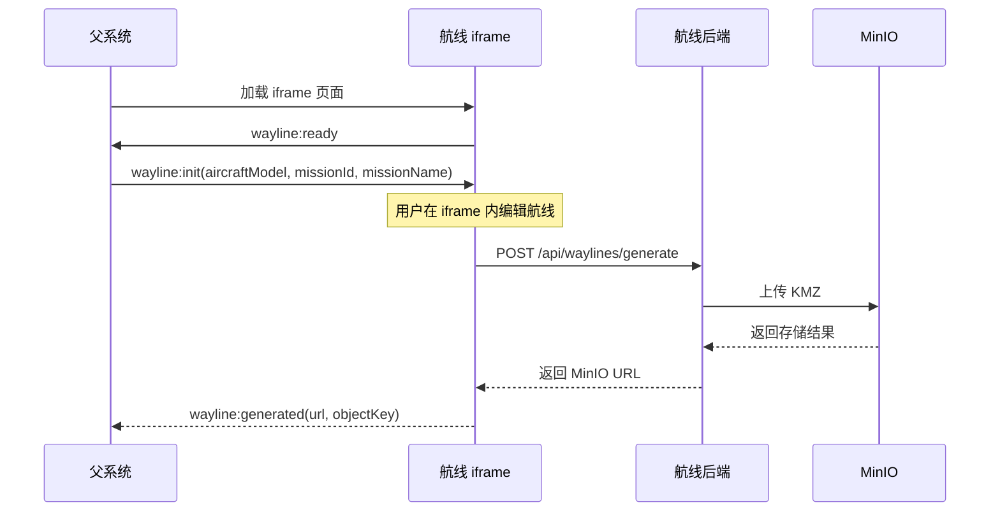

# 航线系统 iframe 嵌套对接文档

## 1. 目标

将航线系统以 `iframe` 的方式嵌入到父系统中，让用户直接在嵌套页面内完成航线编辑和生成；生成完成后，由航线系统调用后端上传 KMZ 到 MinIO，并把 MinIO 链接回传给父系统。

## 2. 角色划分

### 2.1 父系统

职责：

- 打开并承载航线系统 `iframe`
- 向 `iframe` 发送初始化参数
- 接收航线生成结果
- 将返回的 MinIO 链接保存到自身业务系统

### 2.2 航线前端系统

职责：

- 作为 `iframe` 页面运行
- 接收父系统初始化参数
- 提供航线编辑、机型展示、航点配置、生成入口
- 点击生成时调用航线后端
- 将生成结果回传给父系统

### 2.3 航线后端系统

职责：

- 接收航线生成请求
- 根据航线参数生成 KMZ
- 上传到 MinIO
- 返回 MinIO URL

## 3. 总体流程

```text
父系统打开 iframe
-> iframe 加载航线系统
-> iframe 通知父系统 ready
-> 父系统发送初始化参数
-> 用户在 iframe 内编辑航线
-> 用户点击“生成 KMZ”
-> iframe 调用后端 /api/waylines/generate
-> 后端生成 KMZ 并上传 MinIO
-> 后端返回 MinIO URL
-> iframe 将 URL 回传给父系统
-> 父系统保存 URL 并完成业务流程
```

## 4. 推荐方案

推荐采用：

- 前端跨窗口通信：`window.postMessage`
- 文件生成：航线后端接口
- 文件存储：MinIO

原因：

- 父系统不直接操作航线组件内部状态
- 航线编辑逻辑保留在航线系统内，边界清晰
- 生成和上传在后端完成，更利于统一控制和后续扩展

## 5. iframe 通信协议

建议统一约定以下消息类型。

### 5.1 `wayline:ready`

用途：
航线系统加载完成后，通知父系统“可以发送初始化参数了”。

发送方：
`iframe`

示例：

```json
{
  "type": "wayline:ready",
  "payload": {
    "version": "1.0.0"
  }
}
```

### 5.2 `wayline:init`

用途：
父系统向航线系统发送初始化信息。

发送方：
父系统

示例：

```json
{
  "type": "wayline:init",
  "payload": {
    "callbackId": "cb-001",
    "missionId": "task-1001",
    "missionName": "巡检任务A",
    "aircraftModel": "m4d",
    "routeType": "waypoint"
  }
}
```

字段说明：

| 字段 | 类型 | 必填 | 说明 |
| --- | --- | --- | --- |
| callbackId | string | 否 | 回调跟踪 ID，建议传 |
| missionId | string | 否 | 父系统任务 ID |
| missionName | string | 否 | 默认航线名称 |
| aircraftModel | string | 是 | 默认机型 |
| routeType | string | 否 | 默认航线类型，默认 `waypoint` |

### 5.3 `wayline:generated`

用途：
航线系统生成并上传成功后，回传 MinIO 链接。

发送方：
`iframe`

示例：

```json
{
  "type": "wayline:generated",
  "payload": {
    "callbackId": "cb-001",
    "missionId": "task-1001",
    "missionName": "巡检任务A",
    "bucket": "demo-bucket",
    "objectKey": "wayline/saas_wailine/2026-06-11T09-30-00-000Z_task-1001_巡检任务A.kmz",
    "url": "http://minio.xxx/.../xxx.kmz?...",
    "signedUrl": "http://minio.xxx/.../xxx.kmz?...",
    "publicUrl": "http://minio.xxx/.../xxx.kmz"
  }
}
```

### 5.4 `wayline:error`

用途：
航线生成失败后，回传错误信息。

发送方：
`iframe`

示例：

```json
{
  "type": "wayline:error",
  "payload": {
    "callbackId": "cb-001",
    "missionId": "task-1001",
    "message": "MinIO upload failed: 403 Forbidden"
  }
}
```

## 6. 机型字段约定

外部系统建议传 `aircraftModel` 字符串，不建议直接传数值枚举。

支持的常用机型 ID：

- `m30`
- `m30t`
- `m3e`
- `m3t`
- `m3m`
- `m3d`
- `m3td`
- `m4e`
- `m4t`
- `m4d`
- `m4td`
- `m400`

示例：

- `m4d` = Matrice 4D
- `m4td` = Matrice 4TD
- `m4e` = Matrice 4E
- `m4t` = Matrice 4T

## 7. 后端接口

航线系统在点击“生成 KMZ”时，应调用后端：

`POST /api/waylines/generate`

接口详细说明见：
[wayline-api.md](D:\desktop\UAV\dji_way_line_business\docs\wayline-api.md)

### 7.1 推荐请求体

```json
{
  "missionId": "task-1001",
  "missionName": "巡检任务A",
  "config": {
    "routeType": "waypoint",
    "aircraftModel": "m4d"
  },
  "waypoints": [
    {
      "lat": 31.1001,
      "lng": 104.1001,
      "height": 30,
      "speed": 5
    }
  ]
}
```

### 7.2 返回体

```json
{
  "code": 0,
  "message": "ok",
  "data": {
    "bucket": "demo-bucket",
    "objectKey": "wayline/saas_wailine/xxx.kmz",
    "endpoint": "http://192.168.15.175:32090",
    "publicUrl": "http://192.168.15.175:32090/demo-bucket/wayline/saas_wailine/xxx.kmz",
    "signedUrl": "http://192.168.15.175:32090/demo-bucket/wayline/saas_wailine/xxx.kmz?...",
    "url": "http://192.168.15.175:32090/demo-bucket/wayline/saas_wailine/xxx.kmz?..."
  }
}
```

## 8. 前端对接实现建议

## 8.1 父系统示例

```html
<iframe
  id="waylineFrame"
  src="http://localhost:5174/"
  style="width: 100%; height: 900px; border: 0;"
></iframe>
```

```js
const iframe = document.getElementById('waylineFrame');

window.addEventListener('message', (event) => {
  const data = event.data;
  if (!data || typeof data !== 'object') return;

  if (data.type === 'wayline:ready') {
    iframe.contentWindow.postMessage({
      type: 'wayline:init',
      payload: {
        callbackId: 'cb-001',
        missionId: 'task-1001',
        missionName: '巡检任务A',
        aircraftModel: 'm4d',
        routeType: 'waypoint'
      }
    }, '*');
  }

  if (data.type === 'wayline:generated') {
    console.log('生成成功', data.payload.url);
    // 这里写父系统自己的保存逻辑
  }

  if (data.type === 'wayline:error') {
    console.error('生成失败', data.payload.message);
  }
});
```

## 8.2 航线系统 iframe 页示例

```js
window.parent.postMessage({
  type: 'wayline:ready',
  payload: {
    version: '1.0.0'
  }
}, '*');

window.addEventListener('message', (event) => {
  const data = event.data;
  if (!data || typeof data !== 'object') return;
  if (data.type !== 'wayline:init') return;

  const payload = data.payload || {};

  // 这里将 aircraftModel / missionId / missionName
  // 写入当前航线编辑器的默认状态
  console.log('收到初始化参数', payload);
});
```

## 8.3 生成成功后回传示例

```js
window.parent.postMessage({
  type: 'wayline:generated',
  payload: {
    callbackId: 'cb-001',
    missionId: 'task-1001',
    missionName: '巡检任务A',
    url: result.url,
    signedUrl: result.signedUrl,
    publicUrl: result.publicUrl,
    objectKey: result.objectKey,
    bucket: result.bucket
  }
}, '*');
```

## 8.4 生成失败后回传示例

```js
window.parent.postMessage({
  type: 'wayline:error',
  payload: {
    callbackId: 'cb-001',
    missionId: 'task-1001',
    message: error.message || '生成失败'
  }
}, '*');
```

## 9. 推荐的页面行为

建议航线系统遵循下面的行为：

1. iframe 页面加载后立即发送 `wayline:ready`
2. 父系统收到后再发送 `wayline:init`
3. iframe 收到初始化参数后：
   - 设置默认机型
   - 设置默认任务名
   - 设置默认航线类型
4. 用户在 iframe 内自由编辑
5. 用户点击“生成 KMZ”后：
   - 调航线后端接口
   - 上传 MinIO
   - 回传 `wayline:generated`
6. 若失败，则回传 `wayline:error`

## 10. 安全建议

正式环境不建议一直使用 `'*'` 作为 `postMessage` 的目标域。

建议：

1. 父系统固定航线系统域名
2. iframe 固定父系统来源域名
3. `message` 监听时校验 `event.origin`

示例：

```js
const allowedOrigin = 'https://parent.example.com';

window.addEventListener('message', (event) => {
  if (event.origin !== allowedOrigin) return;
  // 通过校验后再处理消息
});
```

## 11. 时序图



## 12. 分阶段实施建议

建议按下面顺序做：

### 第一阶段

- 打通 `wayline:ready`
- 打通 `wayline:init`
- iframe 能正确接收默认机型

### 第二阶段

- 将“生成 KMZ”改为调用后端接口
- 返回 MinIO URL

### 第三阶段

- 将生成结果通过 `wayline:generated` 回传父系统
- 父系统完成业务存储

### 第四阶段

- 加入 `origin` 校验
- 加入错误提示、重试、生成中状态

## 13. 最终建议

这套集成方式里：

- 用户操作始终发生在 `iframe` 内
- 父系统只做嵌套、初始化和结果接收
- 文件生成和存储统一由航线后端处理

这是当前最稳、最清晰、后续最容易扩展的方案。

